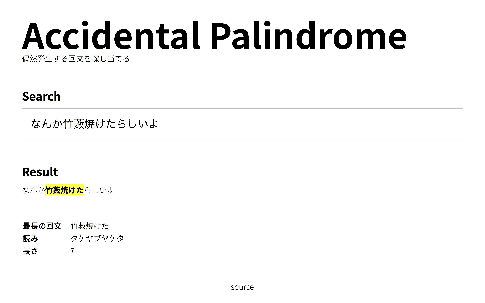

# Accidental Palindrome - 偶然回文

文章中に偶然含まれている回文をさがすサービスです。

## Example



- "なんか竹藪焼けたらしい" -> "竹藪焼けた"
- "そんな、まさか逆さまなのか？" -> "まさか逆さま"

## Development

### Dependencies

- Ruby
- MeCab

### Getting Started

```shell
$ script/bootstrap
$ rails server
```
